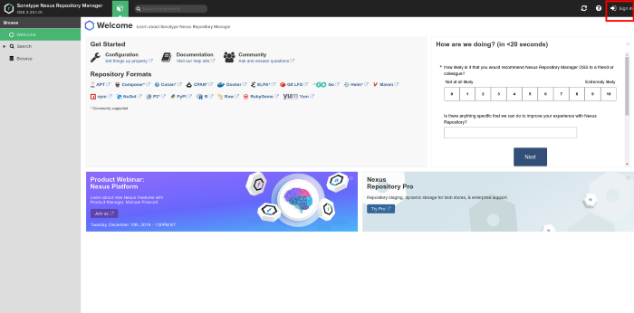
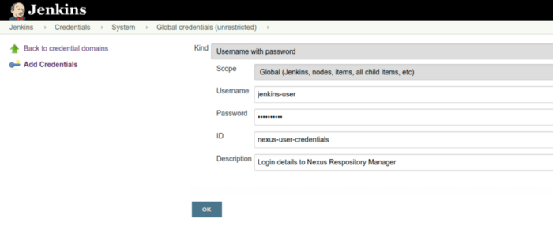
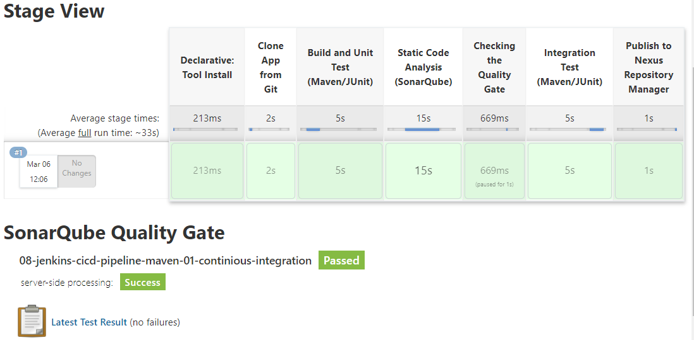

# JenkinsCI : Continious Integration
---

## Toolset for the CI Pipeline
The example project for which we are implementing CI is a simple Maven Java Web application. In
this lab, we will see Jenkins working closely with many other tools. The following table
contains the list of tools and technologies involved in everything that we will be seeing:
   The example project for which we are implementing CI is a simple Maven project. 
   
   |   Tool | Role |
|---------|------------| 
|**Jenkins**| Continuous Integration tool|
|**Java**  |Primary programming language used for coding |
|**Maven** |Build tool|
|**JUnit** |Unit testing and integration testing tools |
|**GitHub** |Version control system |
|**SonarQube** |Static code analysis tool |
| **Sonatype Nexus OSS** |Binary repository manager|

## Required Setup for the Pipeline

### Starting SonarQube and configuring the Web Hook

- Start the SonarQube Container
  ```
  docker run  --name my_sonarqube -p 9000:9000 sonarqube:lts  
  ```
  Connect to Sonarqube on `http://localhost:9000` and check it is running

- Install the **SonarQube Scanner plugin** for Jenkins

- Configure the SonarQube server in Jenkins

     -  Name: my_sonarqube_in_docker
     -  Server URL: `http://host.docker.internal:9000`
     -  Authentication: NONE
     Be sure that the Jenkins URL should be:` http://host.docker.internal: 8080`

- Back to SonarQube dashbooard and create a web hook to Jenkins

   - From  "Administration" menu option, select "Configuration" option, then choose Web Hooks from its Dropdown
   - Configure the web hook
      - Give a name to the Web hook (for example my-webhook-to-jenkins)
      - URL: `http://host.docker.internal:8080/sonarqube-webhook/` (Use strictly this form)
      - No need to fill in the secret as we are conversing anonymously with SonarQube.

### Starting Nexus et Creating a Repository and User

- Start the SonarQube Container
  ```shell
  docker run -d --name my_nexus3 -p 8081:8081 sonatype/nexus3  
  ```
  Connect to Nexus on `http://localhost:8081` and check it is running. 
  
  You have to login in order to administer Nexus.  The default username is `admin`, whereas to retrieve the password you need to run the following command:

   ```shell
   docker exec -i my_nexus3 cat /nexus-data/admin.password
   ```
   
   The next step is to create a new repository.

- Create a Repository in Nexus
  In this step, you are going to create a Maven Hosted Snapshot repository in Nexus, where your Jenkins is going to upload "Snapshot" artifacts.
   - Follow the below-mentioned steps to create a hosted repository, name it as `mylocalrepo-snapshots`.
  
     
  
     In Version Policy, select the `Snapshot` type of artifacts.
   - Under the Hosted section, in Deployment policy, select `Allow redeploy`. It will allow you to deploy an application multiple times.
- Create a new User for the repository 
To create a new user, go to Dashboard > Server Administrator and Configuration > User > Create user. Select Local user type which happens to be the default Realm:
In the Create User page,
   - ID: Enter the desired ID; in our case, it is `jenkins-user`.
   - First Name: Enter the desired first name; in our case, it is `Jenkins`.
   - Last Name: Enter the desired second name; in our case, it is `User`.
   - Email: Enter your email address.
   - Status: Select `Active` from your drop-down menu.
   - Roles: Make sure that you grant the `nx-admin` role to your user.
     In case you want more details for user creation, then [click here](https://help.sonatype.com/repomanager3/security/users).

- Install and Configure Nexus Plugins in Jenkins
Here you are going to install and configure a few plugins for Nexus in Jenkins. For this, go to Jenkins and then Dashboard > Manage Jenkins > Manage Plugins > Available and search and install** Nexus Artifact Uploader** and **Pipeline Utility Steps**.

- Add Nexus Repository Manager's user credentials in Jenkins. Go to Dashboard > Credentials > System > Global credentials (unrestricted), as shown below:


## The CI pipeline

This is the structure of the CI pipeline:
1. Fetch the code from the version control system (SCM) 
2. Build and unit test the code, and publish a unit test report on Jenkins.
3. Perform static code analysis on SonarQube. Fail if the pipeline if the quality  gate is not passed.
1. Perform integration testing and publish a unit test report on Jenkins.
2. Upload the built artifacts to Nexus along with the POM file.
   
The figure below shows the stages of the pipeline.



